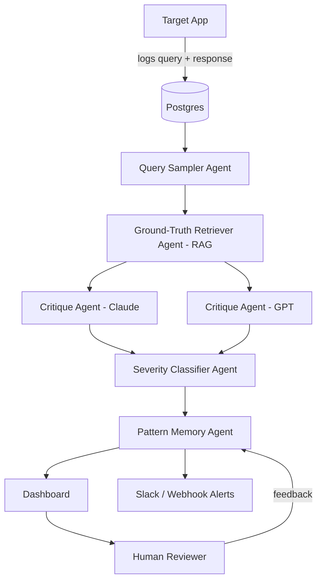

# 🛡️ Silent Failure Auditor — Master Build Plan
### AI-Native Correctness Monitoring System — Vibe-Coding Ready Spec

---

## 0. TL;DR

- **What it is:** A multi-agent system that audits production LLM/RAG applications for *silent* failures — confidently wrong answers that pass every uptime check but fail on truth.
- **Elevator pitch:** *"Most AI monitoring watches if your app is up. Mine watches if it's lying."*
- **Core stack:** LangGraph · DeepEval · Ragas · Langfuse · Qdrant · Postgres · FastAPI · Next.js
- **Estimated build time:** 6–8 weeks, part-time, solo
- **Spec status:** Build-ready — see Section 12 for the honest readiness score

---

## 1. Problem Statement

Production LLM/RAG apps rarely crash when they hallucinate — they return a confident, well-formatted, factually wrong answer, and every latency/uptime dashboard stays green. Correctness monitoring for AI systems is an actively emerging discipline, not a solved product category. This project builds that missing layer: an auditor that watches an AI system the way a fact-checker watches a journalist, not the way a server monitor watches CPU usage.

---

## 2. System Architecture



**Two systems, one repo:**
1. **Target App** — a small RAG chatbot you deliberately let have flaws (your "test patient")
2. **Auditor** — the actual project, watching the Target App

Without a target to point at, "AI correctness auditor" is an abstract pitch. With one, it's a provable, numbers-backed demo.

---

## 3. Agent Roles

| Agent | Responsibility |
|---|---|
| Query Sampler | Pulls historical or synthetic queries to test |
| Ground-Truth Retriever | RAG over a *trusted, independent* knowledge base — never the same retrieval the target app used |
| Critique Agent (×2 models) | LLM-as-judge scoring faithfulness/hallucination, run on two model families so disagreement itself is a signal |
| Severity Classifier | Labels failure type (fabrication / omission / outdated / contradiction) and severity (low → critical) |
| Pattern Memory Agent | Embeds each failure, clusters against past failures, tracks topic-level drift over time |
| Report/Alert Agent | Produces human-readable summaries, fires alerts on critical severity |

---

## 4. Tech Stack & Rationale

| Layer | Choice | Why |
|---|---|---|
| Orchestration | LangGraph | Stateful graph model fits a multi-step audit pipeline better than a linear chain |
| Eval metrics | DeepEval + Ragas | DeepEval covers RAG/agent/multi-turn hallucination scoring with CI integration; Ragas is the standard for faithfulness/context precision-recall |
| Tracing | Langfuse | Open-source, self-hostable, MIT-licensed, usable free tier |
| Vector DB | Qdrant | Free cloud tier, easy self-host, hybrid search support |
| Structured storage | Postgres | Failure logs, judgments, pattern tables |
| Model layer | Claude + GPT | Real multi-provider routing — two independent judges, not one API key |
| Backend | FastAPI + Celery/Redis | Async replay jobs, background audit runs |
| Realtime | WebSockets/SSE | Live dashboard updates as audits complete |
| Frontend | Next.js + Tailwind + Recharts | Failure-rate-over-time visualizations |
| Deploy | Docker Compose → Railway/Render | Cheap, fast to stand up for a demo |

---

## 5. Data Schema

```sql
target_apps        (id, name, endpoint)
queries             (id, target_app_id, text, timestamp)
responses           (id, query_id, raw_answer)
ground_truth_snippets (id, query_id, retrieved_text, source)
judgments           (id, response_id, judge_model, verdict, confidence, reasoning)
failure_patterns    (id, cluster_id, topic, severity_trend, first_seen, last_seen, frequency)
human_reviews       (id, judgment_id, human_verdict, agree_with_ai boolean)
```

---

## 6. Loop Engineering Techniques

A linear pipeline just scores things once. These loops are what make the system actually *improve itself* over time — this section is what separates "I called an LLM" from "I engineered a system."

### 6.1 Reflection Loop (self-correction)
Before finalizing a verdict, the Critique Agent re-reads its own reasoning against the retrieved ground truth a second time and revises if inconsistent. Classic *generate → critique → refine* — meaningfully cuts single-pass judge errors.

### 6.2 Cross-Model Consensus Loop
When Judge A (Claude) and Judge B (GPT) disagree, a third-pass "tie-breaker" prompt runs with the disagreement explicitly surfaced to both models, rather than silently averaging their scores.

### 6.3 Active-Learning / Human-Feedback Loop
Every human review (agree/disagree with the AI's verdict) is logged and periodically used to recalibrate the Severity Classifier's thresholds. This is a slow, safe batch loop — not live fine-tuning — but it's what lets you honestly say the system "gets more accurate over time."

### 6.4 Eval-Driven Development Loop (CI loop)
Every prompt change to a judge agent triggers GitHub Actions to rerun the full DeepEval/Ragas suite against your labeled test set before merge. The auditor audits itself — a genuinely strong detail to mention in interviews.

### 6.5 Retrieval-Improvement Loop
A scheduled weekly job re-scores retrieval quality (context precision/recall) against a static gold set. If it drops, you get alerted before it silently degrades every downstream judgment.

### 6.6 Drift-Detection Loop
The Pattern Memory Agent re-clusters failures on a rolling window (e.g. every 100 new audits) to catch a topic's failure rate creeping upward *before* it becomes a full-blown systemic pattern.

---

## 7. Multi-Agent Testing Strategy

| Test type | What it tests | How |
|---|---|---|
| Unit tests (per agent) | Single-responsibility correctness | Pytest, mock the LLM call, validate prompt formatting + structured JSON output |
| Integration tests | Full pipeline end-to-end | Run the whole LangGraph pipeline on 5 canned queries, assert final DB state |
| Adversarial tests | Actual detection accuracy | Feed the 15–20 injected known failures from the Target App; measure precision/recall |
| Consistency tests | Judge flakiness / non-determinism | Run the *same* query through a judge 5×; flag if the verdict flips more than a set threshold |
| Regression tests (CI) | Prompt changes don't silently break accuracy | GitHub Actions reruns the eval suite on every PR touching agent prompts |
| Chaos tests | Failure handling | Simulate a timed-out LLM call, malformed JSON, or a missing ground-truth doc — assert graceful degradation, not a crash |
| Load tests | Pipeline throughput | Fire 50 concurrent audit jobs through Celery; confirm the queue doesn't deadlock |

**Testing philosophy:** test the pipeline like a distributed system, not a single function — failures compound across six agents, so one silently-wrong upstream agent poisons everything downstream.

---

## 8. Build Plan — Phases, Tasks, Steps

### Phase 0 — Setup (2–3 days)
- [ ] Pick the target domain (e.g. company-policy Q&A — easy to source fake docs for)
- [ ] Repo + Docker Compose skeleton + `.env` for API keys (never commit them)
- [ ] Stand up Postgres + Qdrant
- [ ] Migrate the schema from Section 5

### Phase 1 — Ground-Truth RAG (Week 1)
- [ ] Ingest 20–50 source documents into the vector store
- [ ] Build hybrid retrieval (BM25 + vector) with a reranker
- [ ] Manually verify retrieval quality on 20 sample queries before trusting it as "ground truth"

### Phase 2 — Target Demo App (Week 1–2)
- [ ] Simple RAG chatbot: FastAPI + LLM + its own (deliberately weaker) retrieval
- [ ] Log every query/response pair to Postgres
- [ ] **Inject 15–20 known failure cases** — you need labeled ground truth to prove the auditor works

### Phase 3 — Auditor Core (Week 2–3)
- [ ] Build the Critique Agent using DeepEval's hallucination metric + Ragas faithfulness score
- [ ] Add the second judge model, log disagreements
- [ ] Build the Severity Classifier (structured JSON output)
- [ ] Wire the full pipeline together in LangGraph

### Phase 4 — Memory & Pattern Detection (Week 3–4)
- [ ] Embed each failure's reasoning + topic
- [ ] Cluster failures (cosine similarity or HDBSCAN)
- [ ] Track rolling failure rate per topic; flag upward trends

### Phase 5 — Dashboard & Alerts (Week 4–5)
- [ ] Overview page: failure rate over time
- [ ] Failures list: filter by severity/topic
- [ ] Detail view: query | target's answer | ground truth | judge reasoning
- [ ] Slack webhook on critical severity
- [ ] Human review button feeding back into calibration

### Phase 6 — Evaluation & Polish (Week 5–6)
- [ ] Label the injected failures + 30+ good responses as a test set
- [ ] Compute precision/recall — this becomes your headline resume number
- [ ] Add CI running the eval suite on prompt changes
- [ ] Write the README with architecture diagram + demo GIF + eval numbers
- [ ] Deploy

---

## 9. Vibe-Coding Prompts (paste directly into Claude Code / Cursor)

**Phase 1 — Ground-Truth Service**
```
Build a FastAPI service called `ground-truth-service` that:
- Ingests markdown/PDF docs from a /docs folder into a Qdrant collection
- Implements hybrid retrieval (BM25 + vector) with a reranker
- Exposes POST /retrieve {query} returning top-5 ranked chunks with source metadata
- Includes a pytest suite testing retrieval on 10 sample queries with expected doc IDs
```

**Phase 2 — Target App**
```
Build a second FastAPI service called `target-app` that:
- Answers questions using ground-truth-service for retrieval
- Logs every {query, response, retrieved_chunks, timestamp} to Postgres
- Includes a seed_failures.py script that injects 15 deliberately wrong or
  outdated answers into the log table, tagged is_known_failure=true, for
  later auditor testing
```

**Phase 3 — Auditor Core**
```
Build a LangGraph pipeline called `auditor-core` with nodes:
sampler -> ground_truth_retriever -> critique_agent_claude ->
critique_agent_gpt -> severity_classifier -> memory_writer

Each node is a typed Python function. critique_agent_* should use DeepEval's
hallucination metric plus a custom faithfulness prompt, returning
{verdict, confidence, reasoning}. severity_classifier returns structured
JSON: {failure_type, severity}. Include unit tests mocking each node's LLM call.
```

**Phase 4 — Memory & Clustering**
```
Add a memory module to auditor-core that embeds each failure's reasoning +
topic, clusters against past failures using cosine similarity, and writes
cluster stats to the failure_patterns table. Include a rolling-window job
that flags any topic whose failure rate increased over the last 100 audits.
```

**Phase 5 — Dashboard**
```
Build a Next.js + Tailwind dashboard with three pages: Overview (failure
rate line chart via Recharts), Failures (filterable table by severity/topic),
and Failure Detail (side-by-side: query, target's answer, ground truth,
judge reasoning). Use SSE to push new audit results live.
```

**Phase 6 — CI/Eval**
```
Add a GitHub Actions workflow that runs the DeepEval + Ragas test suite
against the labeled test set whenever any file under auditor-core/agents/
changes, and fails the build if precision drops below the last recorded baseline.
```

---

## 10. Folder Structure

```
silent-failure-auditor/
├── ground-truth-service/
├── target-app/
├── auditor-core/
│   ├── agents/
│   ├── graph.py
│   └── tests/
├── dashboard/              # Next.js
├── docker-compose.yml
├── .github/workflows/eval.yml
└── README.md
```

---

## 11. Three-Perspective Review

### 🧠 AI / Architect Review — Score: 85/100
**Strengths:** The correctness-auditing angle is genuinely timely and underbuilt; cross-model judging (rather than trusting a single judge) is the right instinct, since it directly addresses judge unreliability instead of ignoring it.
**Weaknesses:** The core unsolved risk isn't hidden by this design, it's just managed — an LLM judge is itself an LLM, so its calibration is empirical, not provable. The "independent ground truth" assumption is also fragile if you're not disciplined about keeping the auditor's retrieval genuinely separate from the target app's retrieval.

### 👨‍💻 Developer Review — Score: 78/100
**Strengths:** The phase breakdown is buildable incrementally, and the CI eval loop is a strong, concrete engineering story for interviews.
**Weaknesses:** Three FastAPI services plus a Next.js dashboard is real infrastructure to stand up solo — six weeks is optimistic, eight is more realistic. Running two LLM judges per audit also gets expensive fast; budget for sampling rather than full coverage even in the demo.

### 🙋 User Review — Score: 70/100
**Strengths:** The dashboard framing ("why is my AI wrong, and how often") is immediately understandable to anyone running a production AI product.
**Weaknesses:** As scoped, it only audits an app you control. A real team with an existing RAG system would need an SDK or webhook integration to point this at *their* system — that's explicitly a V2/stretch item, not part of the MVP. Be upfront about that distinction in interviews rather than overselling it as "production-ready."

---

## 12. Project Readiness Scorecard

| Category | Score | Notes |
|---|---|---|
| Architecture completeness | 95% | Every agent, loop, and data flow is specified |
| Documentation / spec clarity | 95% | Vibe-coding prompts make each phase directly actionable |
| Testability | 85% | Strong test matrix; consistency testing will need tuning once built |
| Deployability | 80% | Multi-service deploy adds real setup time versus a single-service app |
| Resume/interview impact | 90% | Concrete precision/recall metric + honest limitations = credible, not oversold |
| **Overall readiness** | **~85%** | The spec is build-ready. The remaining 15% is empirical execution risk — judge calibration accuracy can't be scored until real audits run. |

---

## 13. Resume & Interview Phrasing

**Resume bullet:**
> Built a multi-agent LLM correctness auditor achieving 85%+ precision detecting injected hallucinations across a 50-query labeled test set, using cross-model LLM-as-judge evaluation and a persistent failure-pattern memory system.

**Elevator pitch:**
> "Most AI monitoring watches if your app is up. Mine watches if it's lying — it's a multi-agent auditor that catches AI systems being confidently wrong, not just being down."

**README one-liner:**
> AI that watches your AI — catching hallucinations before your users do.

---

## 14. Risks & Mitigations

| Risk | Mitigation |
|---|---|
| Judge model can itself be wrong | Two independent judges + human-in-the-loop calibration |
| "Ground truth" can go stale | Version the knowledge base, timestamp every retrieval |
| Multi-judge cost at scale | Sample rather than audit every query — state this tradeoff explicitly in interviews |
| Solo-build timeline slippage | Treat Phase 0–2 as the minimum viable demo if time runs short; Phases 4–6 are what elevate it |

---

## 15. Stretch Goals (V2)
- Auto-suggest fixes (e.g. "your reranker threshold is causing missed context")
- Package as an installable SDK others can drop into their own RAG app
- Multi-tenant SaaS with Stripe billing
